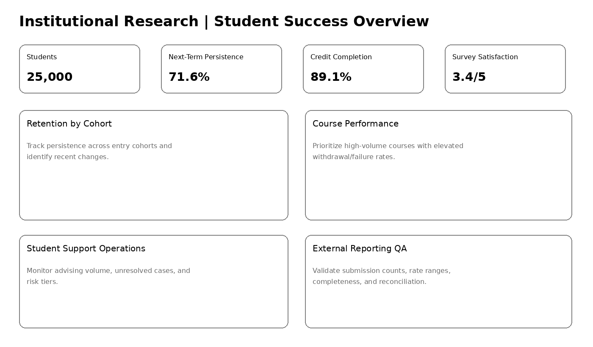
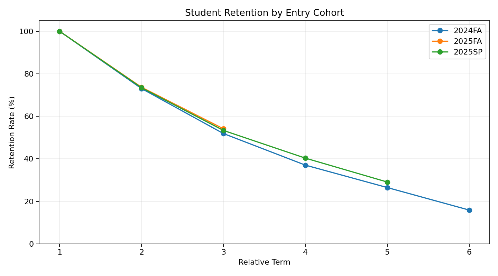
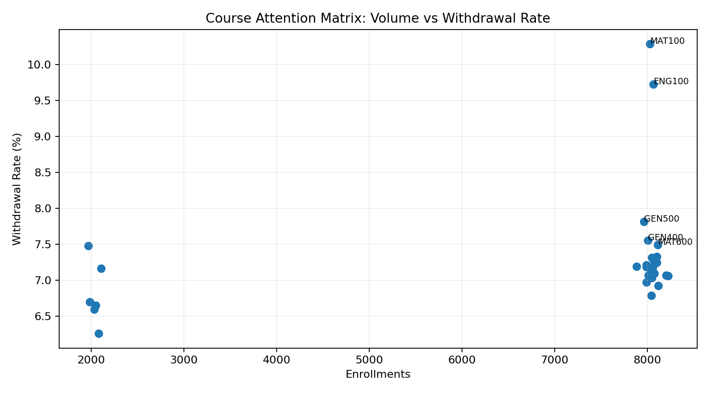

# Institutional Research Analytics Portfolio

**Student Success · Data Quality · External Reporting · Decision Support**

A self-contained institutional research analytics project covering student success, data quality, academic performance, student-support operations, and external reporting.



## Start here
Open **[`notebooks/00_executive_case_study.ipynb`](notebooks/00_executive_case_study.ipynb)** first.

## Executive analytics

| KPI | Result | Decision signal |
|---|---:|---|
| Students | **25,000** | Synthetic institutional cohort |
| Cleaned course enrollments | **241,870** | Academic-performance reporting base |
| Observed next-term persistence | **71.6%** | Student-success monitoring KPI |
| Credit completion | **89.1%** | Academic progress KPI |
| Average survey satisfaction | **3.35 / 5** | Student-experience signal |
| External submission QC | **0 failed checks** | Submission extract reconciles to warehouse |

### 1. Cohort retention



Recent cohorts show broadly similar second-term retention: **73.1% for 2024FA**, **73.7% for 2025FA**, and **73.4% for 2025SP**. The cohort view separates entry timing from cross-sectional enrollment volume and provides a cleaner basis for retention monitoring.

### 2. High-volume courses requiring attention



**MAT100** and **ENG100** combine very high enrollment with elevated withdrawal/failure rates. MAT100 shows a **10.3% withdrawal rate** and **85.0% credit completion**; ENG100 shows a **9.7% withdrawal rate**, **9.4% failure rate**, and **85.1% credit completion**. These are descriptive prioritization signals for academic review, not causal findings.

### 3. Student-support operations

| Advising status | Observed next-term persistence |
|---|---:|
| Contact - resolved | **73.0%** |
| Contact - unresolved | **63.8%** |
| No contact | **73.0%** |

Student terms with unresolved advising contacts show lower subsequent persistence. This is an **association**, not evidence that advising resolution itself causes persistence; it is useful for operational follow-up and workload prioritization.

### 4. Qualitative feedback

| Feedback theme | Responses | Avg. satisfaction |
|---|---:|---:|
| Positive Support | 2,695 | **4.54 / 5** |
| Course Difficulty | 1,432 | **2.51 / 5** |
| Financial Concern | 1,120 | **1.95 / 5** |

Financial-concern feedback has the lowest observed satisfaction, while course difficulty is the second-largest negative theme by volume. A production workflow would use a formal codebook, privacy controls, and inter-rater procedures where appropriate.

### 5. External reporting quality control

The mock external submission passes all six readiness checks: **0 duplicate reporting keys, 0 missing required fields, 0 negative headcounts, 0 negative FTE values, 0 out-of-range rates, and 0 failed row-level QC flags**. Aggregate headcounts reconcile back to the analytical warehouse with zero difference in the validated groups.

### Recommended actions

1. Review high-volume gateway courses with elevated withdrawal/failure rates, beginning with MAT100 and ENG100.
2. Prioritize follow-up for student-term records with unresolved support contacts or multiple operational risk indicators.
3. Track advising resolution alongside subsequent persistence using cautious, associational interpretation.
4. Combine recurring quantitative outcome reviews with structured student-feedback themes.
5. Require a documented QA/reconciliation checklist before external submissions are released.

## Project scope

The work follows an institutional-research reporting cycle from source data through decision support:

- validate and clean student, enrollment, advising, financial-aid, and feedback data;
- build a relational analytical warehouse and reusable reporting datasets;
- analyze persistence, academic performance, student support, and qualitative feedback;
- prepare and reconcile an external-reporting extract;
- communicate findings through notebooks, Excel, Power BI-ready measures, and visual summaries.

## Portfolio at a glance

| Component | Demonstrated skill |
|---|---|
| 25K-student synthetic institutional dataset | Data modeling / privacy-safe portfolio design |
| Raw → cleaned workflow | Accuracy, integrity, validation |
| SQLite analytical warehouse | Relational SQL |
| Student-term mart | Reusable reporting dataset |
| Cohort/persistence analysis | Institutional research |
| Course performance analysis | Academic decision support |
| Advising + feedback analysis | Quantitative + qualitative analysis |
| External submission QC | Data submission / reconciliation |
| Excel reporting package | Microsoft Excel / stakeholder reporting |
| Power BI guide + DAX | Visualization / KPI communication |

## Repository structure

```text
uagc_institutional_research_portfolio/
├── README.md
├── PORTFOLIO_STRUCTURE.md
├── requirements.txt
├── assets/
├── data/
│   └── README.md                    # generated row-level data instructions
├── database/
│   └── README.md                    # generated SQLite instructions
├── notebooks/
│   ├── 00_executive_case_study.ipynb
│   ├── 01_generate_synthetic_data.ipynb
│   ├── 02_data_quality_and_cleaning.ipynb
│   ├── 03_build_sqlite_warehouse.ipynb
│   ├── 04_institutional_research_analysis.ipynb
│   ├── 05_retention_cohort_analysis.ipynb
│   ├── 06_student_support_and_feedback_analysis.ipynb
│   ├── 07_external_reporting_and_submission_qc.ipynb
│   └── 08_build_reporting_exports.ipynb
├── sql/
├── excel/
│   └── Institutional_Research_Reporting_Package.xlsx
├── powerbi/
├── docs/
│   ├── PROJECT_SCOPE.md
│   ├── EXECUTIVE_RECOMMENDATIONS.md
│   ├── DATA_DICTIONARY.md
│   └── EXTERNAL_SUBMISSION_QC.md
└── exports/
```

Large row-level synthetic datasets and the generated SQLite database are intentionally not committed to the public portfolio. Run notebooks `01` → `03` to recreate them; aggregate reporting exports remain available for review.

## Notebook-first design
There are **no Python `.py` scripts**. Every Python workflow file is an `.ipynb` notebook.

## Privacy & interpretation
All records are synthetic. Descriptive relationships are reported as observed associations, not causal effects. In production, student-level reporting would require strict access controls and FERPA/institutional privacy procedures.
